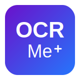

# OCRMe

<div align="center">
  
  <h3>Extract text from images with ease.</h3>
  <p>A cross-platform OCR application with support for multiple languages.</p>
</div>

<div align="center">

[](https://github.com/ALi3naTEd0/OCRMe/releases/latest)
[](LICENSE)
[](https://flutter.dev/)
[](https://github.com/tesseract-ocr/tesseract)

</div>

## 📝 Overview

OCRMe is a modern, cross-platform application that extracts text from images using Optical Character Recognition (OCR) technology. Built with Flutter and powered by Tesseract OCR, it provides an intuitive interface for converting printed or handwritten text in images into editable, digital text.

<div align="center">
  
</div>

## ✨ Features

- 🖼️ **Image to Text**: Extract text from photos, screenshots, PDFs and documents
- 🌐 **Multi-language Support**: Process text in 100+ languages 
- 💾 **Automatic Saving**: Save recognized text automatically or manually
- 📊 **Confidence Scoring**: View accuracy rating for OCR results (coming soon)
- 🔄 **Text Correction**: Intelligent auto-correction of common OCR errors (coming soon)
- ⚡ **Offline Processing**: All OCR happens locally on your device (coming soon)
- 📱 **Cross Platform**: Works on Android, Windows, macOS, and Linux

## 📥 Installation

### Android

Download and install the APK for your device architecture:

- [Universal APK](https://github.com/ALi3naTEd0/OCRMe/releases/latest/download/OCRMe_0.1.0-2.apk)
- [ARM64-v8a APK](https://github.com/ALi3naTEd0/OCRMe/releases/latest/download/OCRMe_0.1.0-2_arm64-v8a.apk) (most modern phones)
- [ARMv7 APK](https://github.com/ALi3naTEd0/OCRMe/releases/latest/download/OCRMe_0.1.0-2_armeabi-v7a.apk)
- [x86_64 APK](https://github.com/ALi3naTEd0/OCRMe/releases/latest/download/OCRMe_0.1.0-2_x86_64.apk)

### Windows

Two options available:

- [Installer (recommended)](https://github.com/ALi3naTEd0/OCRMe/releases/latest/download/OCRMe_0.1.0-2.exe): Run the installer and follow the prompts
- [Portable ZIP](https://github.com/ALi3naTEd0/OCRMe/releases/latest/download/OCRMe_0.1.0-2_portable.zip): Extract and run `ocrme.exe`

### macOS

First, install Tesseract using Homebrew:
```bash
brew install tesseract
```

Then, download and install the app:
- [DMG Installer](https://github.com/ALi3naTEd0/OCRMe/releases/latest/download/OCRMe_0.1.0-2.dmg)

### Linux

All Linux packages require Tesseract OCR to be installed:

```bash
# Debian/Ubuntu
sudo apt install tesseract-ocr

# Fedora
sudo dnf install tesseract

# Arch Linux
sudo pacman -S tesseract
```

Choose your preferred package format:
- [AppImage](https://github.com/ALi3naTEd0/OCRMe/releases/latest/download/OCRMe_0.1.0-2.AppImage): Make executable with `chmod +x OCRMe_0.1.0-2.AppImage` and run
- [DEB Package](https://github.com/ALi3naTEd0/OCRMe/releases/latest/download/OCRMe_0.1.0-2_amd64.deb): `sudo dpkg -i OCRMe_0.1.0-2_amd64.deb`
- [RPM Package](https://github.com/ALi3naTEd0/OCRMe/releases/latest/download/OCRMe_0.1.0-2_x86_64.rpm): `sudo rpm -i OCRMe_0.1.0-2_x86_64.rpm`
- [Flatpak](https://github.com/ALi3naTEd0/OCRMe/releases/latest/download/OCRMe_0.1.0-2.flatpak): `flatpak install OCRMe_0.1.0-2.flatpak`
- [TAR Archive](https://github.com/ALi3naTEd0/OCRMe/releases/latest/download/OCRMe_0.1.0-2_linux_x64.tar.gz): Extract and run `./ocrme`

## 📚 Language System

OCRMe uses a smart language management system:

### Pre-installed Languages
The app comes with 2 core languages pre-installed to keep it lightweight:
- English (eng)
- Spanish (spa)

### Downloadable Languages
When you select a language that isn't pre-installed, OCRMe will:
1. Prompt you to download the language data file
2. Retrieve the file from the official Tesseract GitHub repository
3. Save it locally for future use

<div align="center">
  
</div>

## 🖼️ Screenshots

<div align="center">
  
  
  
</div>

## 🛠️ Development

### Prerequisites

1. Install [Flutter](https://docs.flutter.dev/get-started/install) (v3.29.1 or higher)
2. Install [Tesseract OCR](https://github.com/tesseract-ocr/tesseract)
3. Clone this repository:
